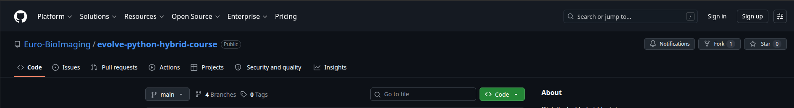
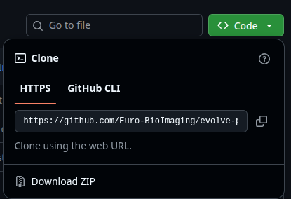
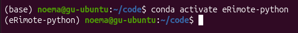

# Python environments and kernels

## GIT
Git is a version control system used to track changes in files and collaborate with other people.
It allows you for example to:

- keep a history of your work
- recover older versions of files
- collaborate on projects

We can use **git** to get all the files needed for the course locally on our machine.

## Install git
### Windows
Install Git from:

https://git-scm.com/install/

During installation, keep the default options.

The installer also provides Git Bash, a terminal application that behaves similarly to terminals on Linux and macOS. 
For this course we recommend using Git Bash rather than PowerShell.
Open Git Bash and verify installation by running:
```
git --version
```

### macOS
Git is often already installed on macOS. Open a Terminal and check running:
```
git --version
```
Alternatively, if you use Homebrew:
```
brew install git
```
### Linux
Open a terminal and run 
```
sudo apt install git
```
Verify the installation:
```
git --version
```
Once Git is installed, navigate to https://github.com/Euro-BioImaging/evolve-python-hybrid-course
you should see something like this. 

Click the green button and copy the https link.



Now navigate to the directory where you want to store the course files and run:
```
git clone <https link>
```
This will create a local copy of the repository on your computer.

## What is an environment

An environment is a specific setup of python version, modules and other installed software that can be reused, repeated 
and distributed. It allows you, in a convenient way, to have multiple versions of python and modules installed.
Environments can be "activated" when they should be used and "deactivated" when they are not needed anymore.
An environment can be stored as a single file and distributed to other people who want to try your experiments or run 
your code.

A Jupyter kernel is the Python interpreter that Jupyter uses to execute code.
In practice, we usually create one kernel for each environment, allowing notebooks to run using the packages installed 
in that specific environment.

## Download and Install miniforge (conda)
### Windows
Download and run the Miniforge installer from:

https://conda-forge.org/download
During installation:

- Accept the default options
- Allow Miniforge to initialize Conda
- Open Miniforge Prompt after installation

You can verify the installation by running:
```conda --version```
### macOS
Download and run the Miniforge installer from:

https://conda-forge.org/download

After installation open a terminal and verify the installation by running:
```
conda --version
```

if Conda is not found run:
```
~/miniforge3/bin/conda init zsh
source ~/.zshrc
```

### Linux
On linux you can run the following command in a terminal, after downloading the installer:
```
chmod +x Miniforge3-$(uname)-$(uname -m).sh
bash Miniforge3-$(uname)-$(uname -m).sh
```
To be able to use it then run:
```
~/miniforge3/bin/conda init
source ~/.bashrc
```
verify installation running:

```
conda --version
```

## Create a conda environment

Once installed we can create our first environment with the following command:
```
conda create -n name_of_env python==3.10
```
Where ```python==3.10``` means we want a specific version (3.10) of python in this environment
and ```name_of_env``` is the name you want to give your environment.
Use a name that allows you to remember what it is used for.

## Activate an environment
To activate the environment:
```
conda activate name_of_env
```
Now your environment is active and the packages installed (and only those) are available to you.
At the beginning of the terminal prompt you should see (name_of_env). See example in the picture:



## Installing python modules in your environment
To install python modules we can use a conda or a program called **pip** . It is preferable to use conda
to install most packages, however, not all packages are present in conda which is when we will use **pip**.
For example, if we want to install the package **pandas** we can do so by running
```
conda install pandas
```
or
```
pip install pandas
```
in case we want to specify a specific version of the package we can use:
```
conda install pandas=x.y.z
```
or
```
pip install module==x.y.z
``` 
respectively. If version is not specified, the latest version available will be installed.

OBS! **Always** activate the environment before installing packages. Otherwise packages may be installed into the wrong 
Python installation.
### Install jupyter tools
In a terminal, with your conda environment active, type
```
conda install jupyterlab ipykernel ipython
```
to install jupyter tools

Start jupyter lab either by typing
```
jupyter lab
```
Notice that your environment is NOT available as kernel :(

Exit jupyter lab.

## Making a conda environment available as kernel for jupyter

With your desired conda environment active, execute the following in a terminal:
```
python -m ipykernel install --user --name=my_env
```
**or**
```
ipython kernel install --user --name=my_env
```

Start jupyter lab again and check if something has changed!


## Sharing and reusing environments
Conda allows you to export your environment to share it with others as well as allowing you to install environments that are shared with you.
To export one of your environments, activate the environment (```conda activate name_of_env```) and type:
```
conda env export --from-history > your_environment.yml
```
This will store the needed data in the file ```your_environment.yml```

In order to create an environment from a file you type, in a terminal:
```
conda env create -f environment.yml
``` 
If the environment gets updated you can run:
```
conda env update -f environment.yml
``` 
This will create an environment as specified in the file ```environment.yml```.

Download this environment file to your computer and try to recreate the environment:
[environment.yml](https://raw.githubusercontent.com/CCI-GU-Sweden/eRImote-python-BIAS-Gtb/refs/heads/main/create_kernel/environment.yml) (by right clicking on the link -> "save link as..." using ```wget``` )

* What is the name of the environment?
* What version of python does it contain?
* Find a few other packages that are installed in the environment
* Export the new environment to be used as a kernel in jupyter lab
* Deactivate all conda environments

Use some of the commands in the list below to answer the questions.

## Useful conda commands
* List environments: ```conda env list```

* Show installed packages in environment: ```conda list```. Combine it with ```|``` and ```grep``` to find a specific package: ```conda list | grep dask``` will list information about the package ```dask``` (if it is installed.

* Deactivate environment (go back to base environment): ```conda deactivate``` 

## Removing a kernel from jupyter (lab)
In order to remove a kernel from jupyter you can use the ```jupyter kernelspec``` command like this:
```
jupyter kernelspec remove --name=name_of_kernel
```
after this command 'name_of_kernel' will no longer be available in jupyter lab.

To see available kernels use the command
```
jupyter kernelspec list
```

## Removing environments

When you want to remove a conda environment you can use:
```
conda env remove -n name_of_environment
```
just make sure you have deactivated the environment or have another environment activated.

CAVEATS: removing an environment does not remove it as a kernel from jupyter!

* Remove all **_kernels_** you created from jupyter (NOT the original named python3)
* Remove any conda **_environments_** you created

## More information / Documentation
Documentation for conda/Miniforge can be found here:
https://conda-forge.org/docs/user/

Documentation for git can be found here:
https://git-scm.com/docs

